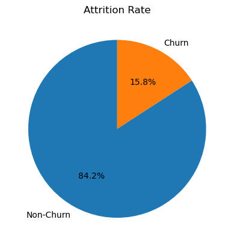
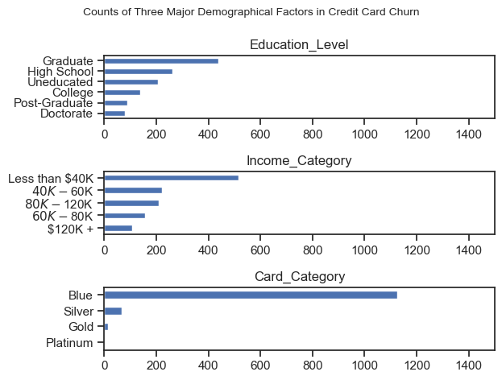
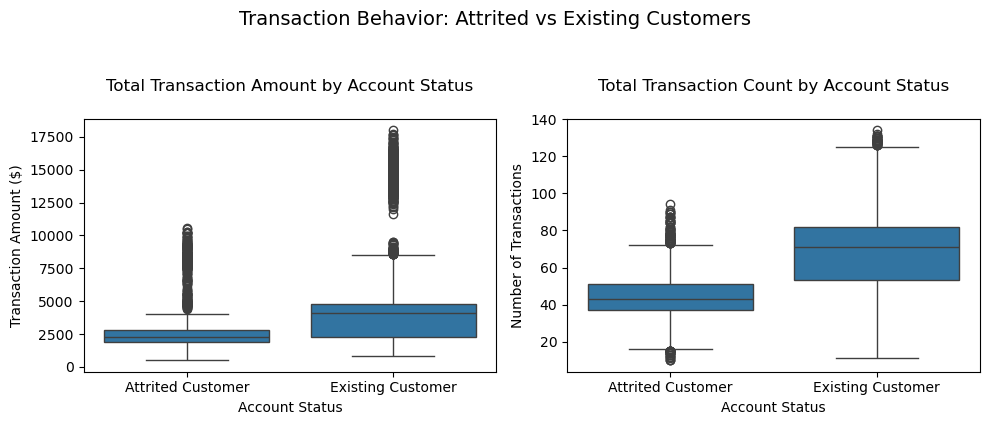
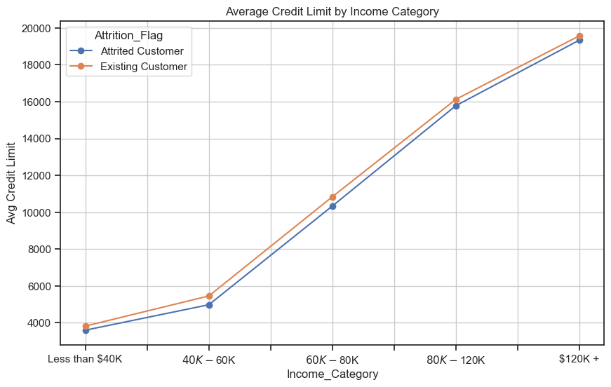

# Overview

Welcome to my analysis of credit card churn. This project was created out of a desire to navigate and understand the types of customers who were leaving the service so that the bank can develop targeted strategies to retain customers and increase engagement with their credit card services.

The data sourced from https://www.kaggle.com/datasets/sakshigoyal7/credit-card-customers?resource=download which provides a foundation for my analysis, containing detailed information on income categories, education level, card cateogories, transaction bahaviors and average credit limits. Through a series of Python scripts, I explore key questions such as attrition rate, demographic factors, transaction behavior and credit limit analysis in data analytics. 


# Goal
1. Investigate customer behavior and churn patterns 
2. Use Python to explore a real-live dataset on credit card customer dataset.
3. For the bank managers: use these insights to improve customer retention strategies


# The Questions 
Below are the questions I want to answer in my project:

1. Attrition Rate
- What is the attrition rate of the credit card service? Is the attrition rate high enough to be noticed and find out the reasons?

2. Demographic Factors
- Which education levels have the highest and lowest churn rates?

-  How does income category relate to churn? Are lower-income customers more likely to leave?

-  Does card category influence churn?

3. Transaction Behavior
-  How do transaction amounts and transaction counts differ between attrited and existing customers?

- Could transaction patterns be used to identify potential churn?

4. Credit Limit Analysis
- How does average credit limit vary by income category for attrited vs. existing customers?


# Tools I used
For my deep dive into the credit card churn, I harnessed the power of several key tools:

- **Python**: The backbone of my analysis, allowing me to analyze the data and find critical insights. I also used the following Python libraires:
     - **Pandas Library**: This was used to analyze the data.

     - **Matplotlib Library**: I visualized the data.
- **Jupyter Notebooks**: The tool I used to run my Python scripts which let me easily include my notes and analysis.

- **Visual Studio Code**: My go-to for executing my Python scripts.

- **Git & GitHub**: Essential for version control and sharing my Python code and analysis, ensuring collaboration and project tracking.


# Data Preparation and Cleanup
This section outlines the steps taken to prepare the data for analysis, ensuring accuracy and usability. 

### Import & Clean Up Data
I start by importing necessary libraries and reading the dataset, followed by initial data cleaning tasks to ensure data quality.


```python
# Importing Libraries
import ast
import pandas as pd
import seaborn as sns
# from datasets import load_dataset
import matplotlib.pyplot as plt  
import matplotlib.ticker as ticker


# Reading Data
df = pd.read_csv('/Users/yangchenqi/Desktop/credit_card_customer_project/BankChurners.csv')

```

```python
# Rename the column names
df.rename(columns={
    'Naive_Bayes_Classifier_Attrition_Flag_Card_Category_Contacts_Count_12_mon_Dependent_count_Education_Level_Months_Inactive_12_mon_1': 'NB_Prob_Active',
    'Naive_Bayes_Classifier_Attrition_Flag_Card_Category_Contacts_Count_12_mon_Dependent_count_Education_Level_Months_Inactive_12_mon_2': 'NB_Prob_Churned'
}, inplace=True)

# Filter out the 'Unknown' variables and convert 'Months_on_book'
df = df[df['Income_Category'] != 'Unknown'] 
df = df[df['Education_Level'] != 'Unknown'] 


df['Years_on_book'] = (df['Months_on_book'] / 12).round(1)

df_cleaned = df.drop('Months_on_book', axis=1)


# Change object type to categorical type
df_cleaned = df_cleaned.apply(lambda col: col.astype('category') if col.dtype == object else col)
```

# The Analysis
The Jupter notebook named `1_EDA_Intro.ipynb` aimed at investigating specific aspects of credit card churn. Here's how I approached each question:

# 1.  Attrition Rate
- What is the attrition rate of the credit card service? Is the attrition rate high enough to be noticed and find out the reasons?

To evaluate the attrition rate, I plot a pie chart with percentages. The visualization demonstrates that customer churn is becoming a serious issue and is worth investigating further.

View my notebook with detailed steps here: [1_EDA_Intro.ipynb](1_EDA_Intro.ipynb)

### Visualize Data
```python
df_plot = df_cleaned['Attrition_Flag'].value_counts().plot(kind = 'pie', startangle = 90, autopct = '%1.1f%%',labels = ['Non-Churn', 'Churn'])
plt.title('Attrition Rate')
plt.ylabel('')
plt.show()
```

### Results



*Pie chart visualizing the attrition rate of the credit card service*

### Insights
The proportion of the attrited customer is approximately 16%. From the scalemath article by Justin Arnold, if a churn rate exceed 7%, then it is a concerning siginal and warrants immediate attention. We can see that the bank is facing the challenge of high churn rate. Thus, it is worth to find the reasons for customer churn in banking through data analytics, including analyze customer behavior and identify potential churners.

https://scalemath.com/blog/what-is-a-good-monthly-churn-rate/


# 2. Demographic Factors
- Which education levels have the highest and lowest churn rates?

-  How does income category relate to churn? Are lower-income customers more likely to leave?

-  Does card category influence churn?

### Visualize Data
To find out the relationship between the demographic factors and churn, I first selected three important demographic factors and, using a for loop, calculates the value counts for each category and plots them as horizontal bar charts in subplots.

``` python
categorical_cols = ['Education_Level', 'Income_Category', 'Card_Category']

#Use subplots() function in matplotlib
fig, ax = plt.subplots(3,1)

#Use plot() function in pandas
#i: index of subplot
for i, demographical_factor in enumerate (categorical_cols):
    counts = df_attrited[demographical_factor].value_counts()
    counts.plot(kind='barh', ax=ax[i], title= demographical_factor)

    
    ax[i].invert_yaxis()
    ax[i].set_ylabel('')
    ax[i].legend().set_visible(False)
    ax[i].set_xlim(0, 1500) # make the scales the same

fig.suptitle('Counts of Three Major Demographical Factors in Credit Card Churn', fontsize =10)
fig.tight_layout()
plt.show()
```
### Results


### **Insights:**

The bar charts above visualize the counts of each demographical factors among the attrited customers.

For `Education_Level`, customers with a graduate degree is the largest groups leaving the credit card services -- almost twice as many as those with no education, who make up the third-largest group. In contrast, customers who gain doctorate degrees are the least likely to leave, accounting for less than 6.5% of all attritied customers. 

In terms of `Income_Category`, customers earning less than $40k per year are the most likely to leave the service, significantly more than those with higher income. Interestingly, customers earning $80K–$120K have a higher number of attrited accounts than those in the $60K–$80K range. 

Regarding `Card_Category`, the majority of attrited customers hold a Blue card, comprising approximately 92.8% of the total attrited customers. However, only 3 customers with a Platinum card left the service. Therefore, the customers owned a Platinum card tend to  remain with the service and show higher loyalty.


# 3. Transaction Behavior
- How do transaction amounts and transaction counts differ between attrited and existing customers?

- Could transaction patterns be used to identify potential churn?

### Visualize Data
To identify the pattern of transaction amount and transaction count between attrited and existing customers, I first calculate the mean of `Total_Trans_Amt` and `Total_Trans_Ct` by pivot table. Then I do the boxplots to find out the numeric values such as mean, median, maximum and minimun. 

``` python
plt.figure(figsize=(10, 4))

# First subplot - Transaction Amount
plt.subplot(1, 2, 1)
sns.boxplot(data=df_cleaned, x='Attrition_Flag', y='Total_Trans_Amt')
plt.title('Transaction Amount by Account Status', pad=20)  
plt.xlabel('Account Status')  
plt.ylabel('Transaction Amount ($)') 

# Second subplot - Transaction Count
plt.subplot(1, 2, 2)
sns.boxplot(data=df_cleaned, x='Attrition_Flag', y='Total_Trans_Ct')
plt.title('Transaction Count by Account Status', pad=20)  
plt.xlabel('Account Status')  
plt.ylabel('Number of Transactions')  

# add title
plt.suptitle('Transaction Behavior: Attrited vs Existing Customers', y=1.05, fontsize=14)

plt.tight_layout()  
plt.show()
```


### Results



### Insights

*Transaction Amount Comparison*
- Attrited customers have a mean transcation amount of approximately $2,500, while existing customers average approximately twice as attrited customers (~$5,000). 
- Existing customers show a wider range of transactions ($0 to $9,000), compared to attrited customers ($0 to $4,500).
- Existing customers have extreme outliers (up to $17,500),  significantly higher than attrited customers' maximum outlier(~$11,000)


*Transaction Count Comparison*
- The mean of transaction count for existing customers is approximately 75 that is higher than that for attrited customers which approximately 43.
- The maximum value of attrited customers is 50 transcations last year that is a lot lower than that of existing customers has maximum 130 transactions.
- IQR for existing customer is significantly wider than attirtied customer, indicating greater variability in transaction frequency. Interestingly, 75 % of attrited customers perform fewer transcations than the bottom 25 % of existing customers. 

- Could transaction patterns be used to identify potential churn?

From the transaction behavior, we can observe that existing customers are more active on account transcation regardless of count or amount. The customers that both have low transaction amount(< 2500) and low transaction count(< 50) have high churn-risk and more likely to churn. 


# 4. Credit Limit Analysis
- How does average credit limit vary by income category for attrited vs. existing customers?

- Does the number of dependents affect credit limit differently for churned vs. retained customers?

### Visualize Data 
I first calculate the mean of credit limit for different kinds of income cateogry and dependent count. Then, I use line charts to find out the relationship between the average credit limit and demographic factors (income category and dependent count). 

```python 
# Average credit limit vs Income category
df_credit_income.plot(kind='line', marker='o', figsize=(10, 6), title='Average Credit Limit by Income Category')
plt.ylabel('Avg Credit Limit')
plt.grid(True)
plt.show()
```

```python 
# Average credit limit VS Dependent count
df_credit_dependent.plot(kind='line', marker='o', figsize=(10, 6), title='Average Credit Limit by Dependent Count')
plt.ylabel('Avg Credit Limit')
plt.grid(True)
plt.show()
```

### Results



### Insights
From Income vs Credit Limit Plot, I observe that both existing and attrited customers show similar credit limit patterns correlated with income. As income increases,credit limits rise proportionally for both customer groups. 

This demonstrates that income is the primary consideration of credit limits. The bank uniformly applies a income-based evaluation when setting credit limits, regardless of attrition risks.


# What I Learned
Throughout this project, I deepened my understanding of customer churn and enhanced my technical skills in Python, especially in data manipulation and visualization. Here are a few specific things I learned:

- **Advanced Python Usage**: 
Utilizing libraries such as Pandas for data manipulation, Seaborn and Matplotlib for data visualization, and other libraries helped me perform complex data analysis tasks more efficiently.

- **Data Cleaning Importance**: I learned that thorough data cleaning and preparation are crucial before any analysis can be conducted, ensuring the accuracy of insights derived from the data.

- **Churn Risk Indicators** : By analyzing attrition rates, demographic factors, transaction behavior, and credit limits, I learned how to identify at-risk customers. In particular, customers with low transaction frequency (<50) and low transaction amounts (<$2,500) were significantly more likely to churn.


# Conclusion
This analysis of credit card customer churn provided actionable insights for reducing attrition:

**High Attrition Rate (16%)**: The bank's churn rate is more than double the acceptable churn rate of 7%, implied that the bank  requires to address the issue. 

**Demographic Factors**: Lower-income customers and those with graduate-level education were more likely to leave. Platinum cardholders showed higher loyalty, suggesting targeted retention strategies could be developed for graduate-level customers who hold Blue cards.

**Transaction Behavior as a Predictor**: Existing customers are significantly more active in both transaction amount and frequency compared to attrited customers. Low engagement (low counts and amounts) is a strong churn factor.

**Credit Limit Allocation**: The bank sets credit limits for customers primarily based on income. However, other factors should also be considered such as dependent count. 